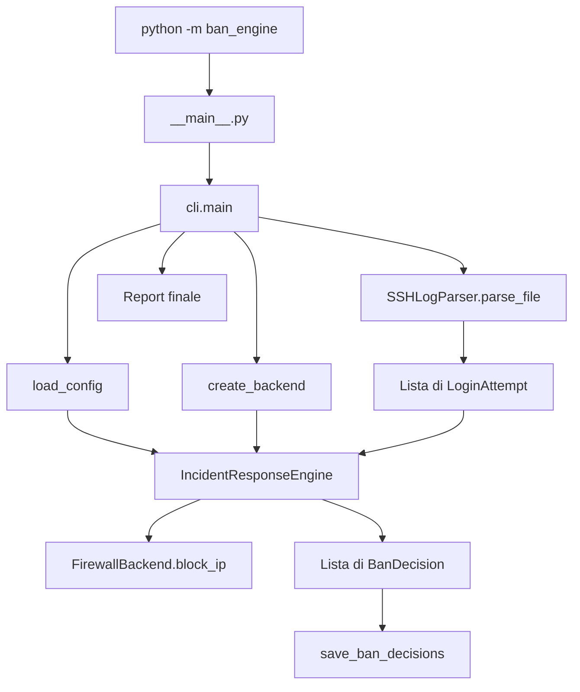
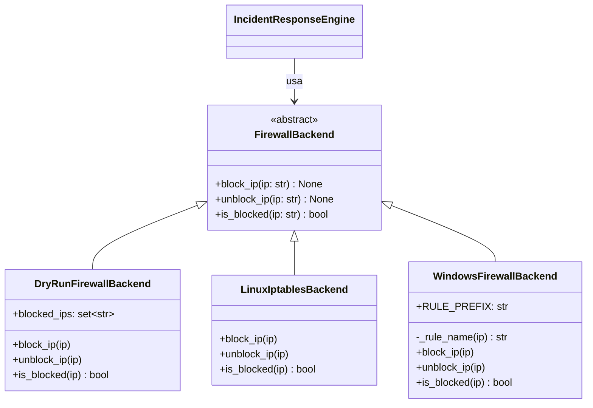

# Manuale tecnico — Automated Incident Response Ban Engine

## 1. Scopo del progetto

Automated Incident Response Ban Engine è un'applicazione da riga di comando che analizza log di autenticazione SSH, riconosce tentativi falliti e decide se un indirizzo IP deve essere bloccato.

Il progetto separa la parte di analisi dalla parte che modifica il firewall. Il motore lavora con un'interfaccia comune e può usare tre implementazioni:

- simulazione sicura in memoria;
- Linux tramite `iptables`;
- Windows tramite `netsh advfirewall`.

La modalità predefinita è il dry-run, quindi il programma non modifica il firewall finché la configurazione non lo abilita esplicitamente.

## 2. Requisiti di sistema

### Requisiti comuni

- Python 3.11 o superiore;
- `pip`;
- accesso a un terminale;
- file di log testuale in formato compatibile con i pattern SSH gestiti dal parser.

### Dipendenze Python

Il codice applicativo usa solo la libreria standard. `pytest` è richiesto per eseguire i test.

Il file `requirements.txt` installa:

```text
-e .
pytest>=8.0
```

L'opzione `-e .` installa il package in modalità editable: le modifiche ai file sotto `src/` vengono viste senza reinstallare il progetto.

### Requisiti per i backend reali

- **Linux:** comando `iptables` disponibile e privilegi sufficienti per modificare le regole firewall.
- **Windows:** comando `netsh` disponibile e terminale aperto come amministratore.

Il backend non viene scelto automaticamente dal sistema operativo. È il valore `backend` della configurazione a stabilire quale classe usare.

## 3. Installazione locale

Dalla root del repository:

```bash
python -m venv .venv
```

Attivazione su Linux o macOS:

```bash
source .venv/bin/activate
```

Attivazione su Windows PowerShell:

```powershell
.venv\Scripts\Activate.ps1
```

Installazione:

```bash
python -m pip install -r requirements.txt
```

Verifica dell'entry point:

```bash
python -m ban_engine --help
```

Esecuzione dei test:

```bash
python -m pytest -q
```

Il file `main.py` nella root non è l'entry point dell'applicazione. L'avvio corretto passa da `src/ban_engine/__main__.py` tramite `python -m ban_engine`.

## 4. Struttura del repository

```text
RepoTest-ProgettoPython/
├── docs/
│   ├── devlog.md
│   ├── manuale-tecnico.md
│   ├── manuale-utente.md
│   ├── proposta.md
│   ├── scelte.md
│   └── uso-ia.md
├── examples/
│   ├── auth.log
│   ├── config.json
│   └── ban_state.json
├── src/
│   └── ban_engine/
│       ├── firewall/
│       │   ├── __init__.py
│       │   ├── base.py
│       │   ├── dry_run.py
│       │   ├── linux.py
│       │   └── windows.py
│       ├── __init__.py
│       ├── __main__.py
│       ├── cli.py
│       ├── config.py
│       ├── engine.py
│       ├── models.py
│       ├── parser.py
│       └── state.py
├── tests/
│   ├── conftest.py
│   ├── test_cli.py
│   ├── test_config.py
│   ├── test_engine.py
│   ├── test_firewall_polymorphism.py
│   ├── test_models.py
│   ├── test_parser.py
│   └── test_state.py
├── pyproject.toml
├── requirements.txt
└── README.md
```

### Responsabilità delle cartelle

- `src/ban_engine/`: codice applicativo installabile.
- `src/ban_engine/firewall/`: gerarchia dei backend firewall.
- `tests/`: test automatici isolati dal sistema operativo.
- `examples/`: dati pronti per demo e prove manuali.
- `docs/`: documentazione destinata a utenti, sviluppatori e valutazione del progetto.

Le cartelle `*.egg-info` eventualmente generate da `pip` contengono metadati di installazione e non fanno parte della logica applicativa.

## 5. Architettura generale



La CLI coordina i componenti, ma non contiene la logica di parsing o di decisione. Questo rende i moduli testabili separatamente.

## 6. Gerarchia dei backend firewall



`FirewallBackend` è una classe astratta. Le sottoclassi ridefiniscono gli stessi metodi e il motore può chiamarli senza controllare il tipo concreto. Il polimorfismo avviene in chiamate come:

```python
self.backend.block_ip(ip)
```

L'engine sa soltanto che l'oggetto rispetta il contratto `FirewallBackend`.

## 7. Moduli principali

### `__main__.py`

È il punto di ingresso del package. Importa `main()` dalla CLI e converte il valore restituito in exit code tramite `SystemExit`.

```python
raise SystemExit(main())
```

### `cli.py`

Gestisce l'intero flusso applicativo.

Funzioni principali:

- `positive_int(value)`: accetta solo interi maggiori di zero;
- `build_parser()`: definisce gli argomenti della CLI;
- `create_backend(name)`: crea il backend indicato dalla configurazione;
- `apply_overrides(config, args)`: applica le opzioni CLI alla configurazione;
- `main(argv)`: esegue caricamento, parsing, analisi, salvataggio e report.

Argomenti disponibili:

- `--log`: obbligatorio, percorso del log;
- `--config`: file JSON opzionale;
- `--dry-run`: forza la simulazione;
- `--threshold`: sovrascrive `max_attempts`;
- `--window`: sovrascrive `window_seconds`;
- `--state`: sovrascrive il percorso dello storico.

La precedenza è:

1. valori predefiniti di `AppConfig`;
2. valori del file JSON;
3. override passati da CLI.

La CLI restituisce `0` in caso di successo e `2` per file mancanti, configurazione errata, errori I/O o fallimenti di `subprocess`.

### `config.py`

Contiene la dataclass `AppConfig`:

```python
@dataclass
class AppConfig:
    max_attempts: int = 3
    window_seconds: int = 300
    whitelist: set[str] = field(default_factory=set)
    backend: str = "dry-run"
    dry_run: bool = True
    state_file: str = "ban_state.json"
```

`load_config()` legge JSON con UTF-8 e valida:

- interi positivi per soglia e finestra;
- lista per la whitelist;
- backend tra `dry-run`, `linux` e `windows`;
- booleano per `dry_run`;
- stringa non vuota per `state_file`;
- indirizzi IP validi nella whitelist.

Se non viene passato alcun percorso, restituisce la configurazione predefinita. Se viene indicato un file inesistente, l'errore viene propagato con un messaggio esplicito.

### `models.py`

Contiene i dati del dominio.

#### `validate_ip(ip)`

Usa `ipaddress.ip_address()` per validare e normalizzare IPv4 e IPv6. In caso di errore solleva `ValueError`.

#### `LoginAttempt`

Campi:

- `timestamp`;
- `ip`;
- `username`, opzionale;
- `raw_line`, la riga originale.

`__post_init__()` valida l'IP e converte una username vuota in `None`. `to_dict()` produce una struttura serializzabile in JSON.

#### `BanDecision`

Campi:

- `ip`;
- `attempts_count`;
- `window_seconds`;
- `reason`;
- `created_at`.

Il modello rifiuta conteggi e finestre non positivi. `to_dict()` converte le date in formato ISO 8601.

### `parser.py`

`SSHLogParser` riconosce tre famiglie di evento:

- `Failed password`;
- `Failed publickey`;
- `Invalid user`.

`parse_line()` prova i pattern in ordine. Quando trova una corrispondenza, crea un `LoginAttempt`; altrimenti restituisce `None`.

`parse_file()` legge il file riga per riga, quindi non carica tutto il log in memoria.

I timestamp SSH non contengono l'anno. `_parse_timestamp()` aggiunge l'anno corrente. Se la conversione fallisce, usa `datetime.now()`.

Nota di manutenzione: il parser usa attualmente un import `src.ban_engine.models`, mentre il resto del package usa principalmente import relativi o `ban_engine...`. L'esecuzione dalla root e l'installazione editable rendono il progetto utilizzabile, ma l'import dovrebbe essere uniformato in una revisione futura.

### `engine.py`

`IncidentResponseEngine` riceve:

- un `FirewallBackend`;
- `max_attempts`;
- `window_seconds`;
- una whitelist opzionale.

`process_attempts()`:

1. raggruppa i tentativi per IP;
2. salta gli IP in whitelist;
3. salta gli IP che il backend considera già bloccati;
4. calcola il massimo numero di eventi nella finestra;
5. blocca l'IP se il valore è maggiore o uguale alla soglia;
6. crea una `BanDecision`.

La soglia è inclusiva: con `max_attempts = 3`, il terzo tentativo dentro la finestra genera il ban.

`_count_attempts_in_window()` ordina gli eventi e prova ogni evento come inizio di una finestra. La complessità nel caso peggiore è quadratica rispetto al numero di eventi dello stesso IP. La scelta favorisce chiarezza e semplicità; per log molto grandi si potrebbe usare una finestra scorrevole con due indici.

### `state.py`

`load_ban_history(path)`:

- restituisce `[]` se il file non esiste;
- legge il JSON;
- richiede che il contenuto sia una lista;
- segnala JSON non valido.

`save_ban_decisions(path, decisions)`:

- non crea o modifica file se la lista è vuota;
- carica lo storico esistente;
- aggiunge le nuove decisioni;
- crea le cartelle mancanti;
- riscrive il JSON con indentazione.

La persistenza conserva lo storico delle decisioni, ma non ricostruisce lo stato del backend all'avvio. Per esempio, il dry-run riparte con un `set` vuoto a ogni processo.

## 8. Backend firewall nel dettaglio

### Dry-run

`DryRunFirewallBackend` conserva gli IP in `blocked_ips: set[str]`.

- `block_ip()` aggiunge l'IP e stampa `[DRY-RUN] Blocco IP: ...`;
- `unblock_ip()` usa `discard()`, quindi non fallisce se l'IP non è presente;
- `is_blocked()` controlla l'appartenenza al set.

È il backend predefinito e quello consigliato per sviluppo, test e demo.

### Linux

Comandi costruiti:

```bash
iptables -A INPUT -s <IP> -j DROP
iptables -D INPUT -s <IP> -j DROP
iptables -C INPUT -s <IP> -j DROP
```

Le operazioni di modifica usano `check=True`. Il controllo interpreta `returncode == 0` come regola presente.

L'implementazione usa `iptables` anche se i modelli accettano IPv6. Non esiste una gestione separata tramite `ip6tables`; il supporto reale agli indirizzi IPv6 dipende quindi dalla configurazione del sistema ed è una limitazione attuale.

### Windows

Le regole hanno nome `BanEngine-<IP>`.

Comandi principali:

```text
netsh advfirewall firewall add rule name=BanEngine-<IP> dir=in action=block remoteip=<IP>
netsh advfirewall firewall delete rule name=BanEngine-<IP>
netsh advfirewall firewall show rule name=BanEngine-<IP>
```

`is_blocked()` richiede sia un codice di uscita zero sia la presenza del nome della regola nell'output.

## 9. Flusso completo dei dati

1. L'utente avvia `python -m ban_engine`.
2. `argparse` valida le opzioni.
3. `load_config()` crea `AppConfig`.
4. `apply_overrides()` applica soglia, finestra, dry-run e percorso dello stato.
5. Se `dry_run` è vero, viene sempre creato `DryRunFirewallBackend`; altrimenti viene usato il backend configurato.
6. La CLI conta le righe del log.
7. `SSHLogParser.parse_file()` produce una lista di `LoginAttempt`.
8. `IncidentResponseEngine.process_attempts()` produce una lista di `BanDecision` e invoca il backend.
9. `save_ban_decisions()` aggiorna lo storico JSON.
10. La CLI stampa il riepilogo.

## 10. Configurazione

Esempio:

```json
{
  "max_attempts": 3,
  "window_seconds": 120,
  "whitelist": [
    "127.0.0.1",
    "::1"
  ],
  "backend": "dry-run",
  "dry_run": true,
  "state_file": "examples/ban_state.json"
}
```

| Campo | Tipo | Default | Significato |
|---|---|---:|---|
| `max_attempts` | intero positivo | `3` | Soglia inclusiva di ban |
| `window_seconds` | intero positivo | `300` | Ampiezza della finestra temporale |
| `whitelist` | lista di stringhe IP | `[]` | IP mai bloccati |
| `backend` | stringa | `dry-run` | `dry-run`, `linux` o `windows` |
| `dry_run` | booleano | `true` | Se vero, ignora il backend reale e simula |
| `state_file` | stringa | `ban_state.json` | Percorso dello storico |

## 11. Test automatici

La suite è organizzata per responsabilità:

- `test_models.py`: validazione IP e serializzazione;
- `test_parser.py`: pattern SSH e righe ignorate;
- `test_firewall_polymorphism.py`: classe astratta, comandi e polimorfismo;
- `test_engine.py`: soglia, finestra, whitelist e duplicati;
- `test_config.py`: default, lettura e configurazioni errate;
- `test_state.py`: storico e JSON non valido;
- `test_cli.py`: flusso dry-run completo ed errore su log mancante.

I backend reali non eseguono comandi durante i test. `subprocess.run()` viene sostituito con mock e vengono controllati gli argomenti ricevuti.

## 12. Estendere il progetto

### Aggiungere un backend

1. Creare una classe che eredita da `FirewallBackend`.
2. Implementare `block_ip()`, `unblock_ip()` e `is_blocked()`.
3. Esportarla da `firewall/__init__.py`.
4. Aggiungere il nuovo nome tra i backend ammessi in `config.py`.
5. Gestirlo in `create_backend()`.
6. Aggiungere test specifici e un test d'uso polimorfico.

### Aggiungere un formato di log

La soluzione più pulita è introdurre un'interfaccia comune per i parser oppure aggiungere pattern mirati a `SSHLogParser`, mantenendo un test per ogni nuovo formato.

### Migliorare l'engine

Per grandi volumi si può sostituire il doppio ciclo con una finestra scorrevole. È possibile anche mantenere uno stato incrementale invece di ricevere ogni volta l'intera lista degli eventi.

## 13. Limiti attuali

- Il programma analizza un file già esistente; non segue il log in tempo reale.
- Il parser copre solo alcuni formati OpenSSH.
- Le righe `Invalid user` e `Failed password` possono essere contate come due eventi distinti anche se appartengono allo stesso tentativo di autenticazione.
- L'anno del timestamp viene assunto uguale all'anno corrente.
- Il fallback di timestamp usa l'ora corrente e può alterare la finestra temporale per righe malformate.
- Lo storico JSON registra le decisioni ma non ripristina i blocchi al riavvio.
- Lo sblocco esiste nei backend ma non è esposto dalla CLI.
- Non c'è rilevamento automatico del sistema operativo.
- Il backend Linux non distingue esplicitamente IPv4 e IPv6.
- Il file di stato viene riscritto interamente a ogni aggiornamento e non usa locking per esecuzioni concorrenti.

Questi limiti non impediscono la demo dell'MVP, ma indicano le aree più naturali per un'evoluzione futura.